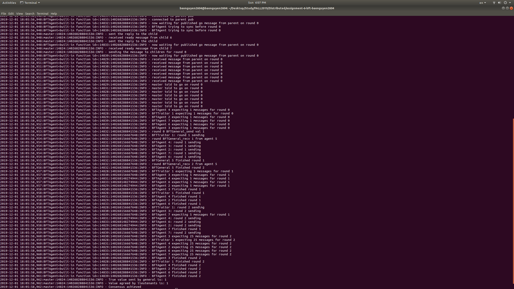

# Byzantine Fault Tolerance

## Code structure
The code remains simialr to Dr Dubey's sample code. The methods in `BFTAgent` are moved into a separate `BFTAgent` class, which has 2 subclasses: `BFTGeneral` and `BFTraitor`. These 3 classes will have different sending and receiving behaviors based on their roles in BFT.

The BFT messages are encapsulated in the `BFTMessage` class, which has helper methods to store and retrieve messages. It also has a reference to a root of a tree-like structure of nodes `BFTNode`. `BFTNode` is a tree node with 3 main variables:
- `val`: represent the value received when this node is created
- `id`: id of the peer who sent `val`
- `children`: list of references to children `BFTNode`. The size of the list depends on the number of processes

The message chain property is retrieved by doing Breadth First Search on the `BFTMessage` tree and the value of the leaf node is used when sending the next message. `BFTMessage` supports the following functions:
- `vote`: calculate the value of current message based on majoring voting of all the children nodes
- `add_message:` add the current message to the tree by traversing through the message chain
- `get_message:` get all the messages to sent by the calling agent by doing BFS from the top of the tree until the message chain length is appropriate

## Configuration file
Configuration for this setup is located in `config.json` and the format is as follow:
```
{
    "agent_numbers": 7,
    "rounds": 3,
    "general_id": 3,
    "traitor_ids": {
        "1": 1,
        "5": 5
    }
}
```

## Running the code
To run the code, simply modify the `config.json` file and execute 
```
python3 master.py
```

## Misc
I tried running with more than 3 traitors (i.e 10, 13, 15 processes) but since the number of messages grow exponentially, I noticed many of the messages were dropped before the other node can receive. This could be due to the UDP nature of the `peersocket`. I have not tested with TCP to confirm it though since adding the TCP handshake could be complicated

## Examples
